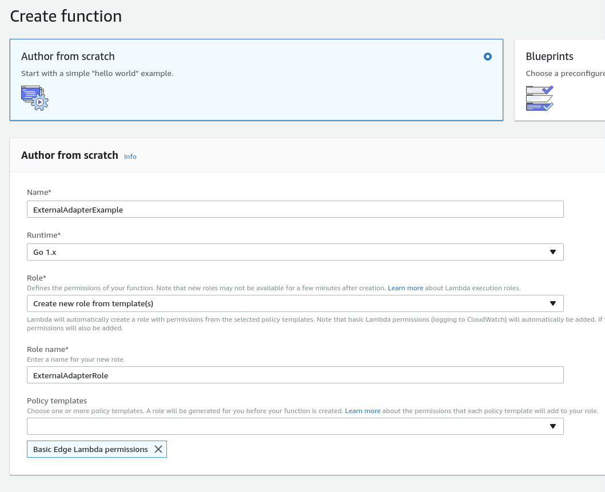
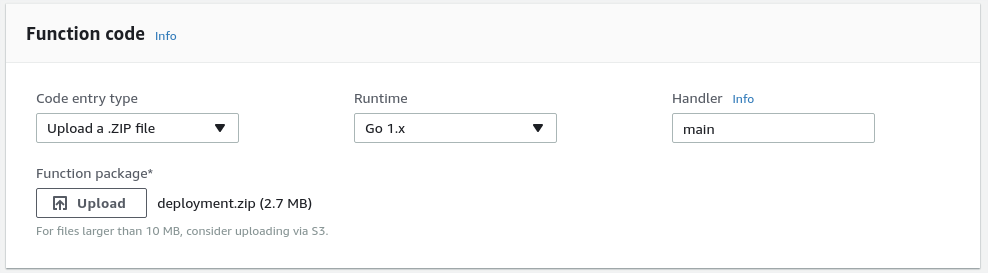
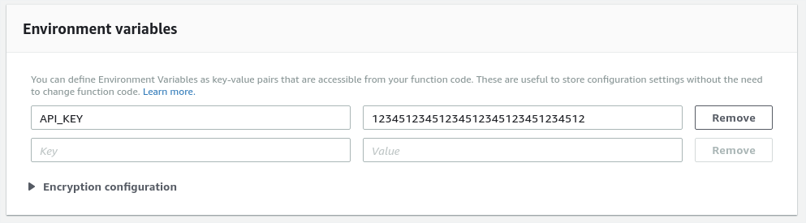
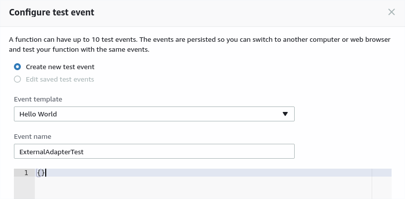
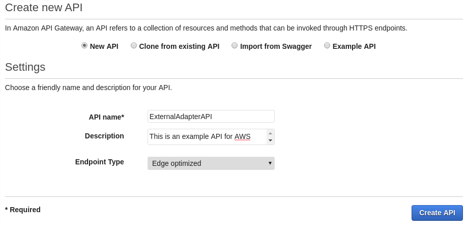
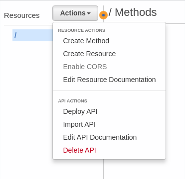
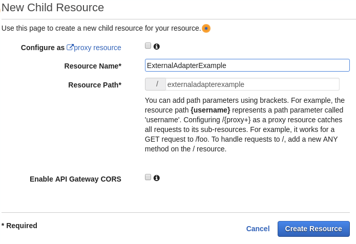
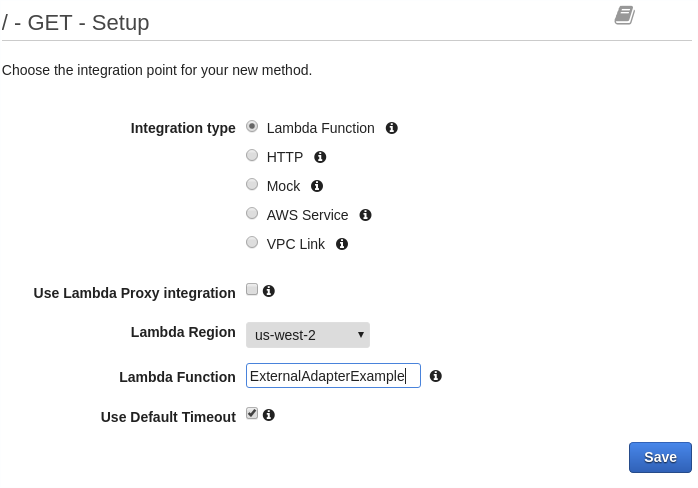
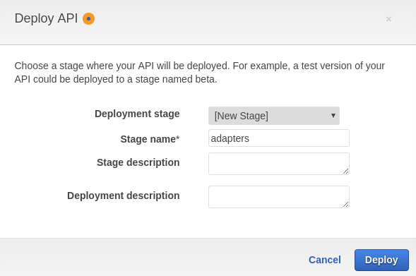

# External Adapter Example

This example originated from [this](https://read.acloud.guru/serverless-golang-api-with-aws-lambda-34e442385a6a) Medium post that explains how to set up a Go function using AWS Lambda.

This repository should serve as an example for making external adapters available for the ChainLink network. At a minimum, developers should provide basic instructions for installing the external adapter. Additional information, like what is contained in the headings listed below, will further help developers and users of the external adapter. The installation instructions below are far more verbose than necessary in order to get someone who isn't familiar with AWS Lambda set up in a way that can be followed step-by-step.

## API Resource

To use this adapter, you will need to create an account with [The Movie DB](https://www.themoviedb.org/documentation/api).

You can then get your API key by going to your Settings, then click on [API](https://www.themoviedb.org/settings/api) (or follow that link when logged in).

Take note of the "API Key (v3 auth)" as that is what we'll use in this adapter.

## Build & Package

First, clone this repository, then enter into the directory

```bash
cd ExternalAdapterExample
```

Build the binary

```bash
GOOS=linux go build -o bin/main src/main.go
```

Zip the binary

```bash
zip deployment.zip bin/main
```

## Testing

Export the API key to the local environment variable `API_KEY`

```bash
export API_KEY=12345123451234512345123451234512
```

Then run the test command

```bash
go test ./...
```

## Installation (AWS Lambda)

> This walkthrough doesn't take any consideration to security. Setting up your AWS Lambda function this way will allow anyone to invoke the function.

The `deployment.zip` file can be added to AWS Lambda either through the command line, as shown below, or through the GUI. 

For the command-line, run this (after change the name and role), then go to the Environment Variables step

```bash
aws lambda create-function \
 --region us-east-1 \
 --function-name ExternalAdapterExample \
 --zip-file fileb://./deployment.zip \
 --runtime go1.x \
 --role arn:aws:iam::<account-id>:role/ExternalAdapterRole \
 --handler main
```

For adding the `deployment.zip` file via the GUI, navigate to `Services` > `Lambda` and click `Create function`

Use the following settings, but again, change the names appropriately:

    Author from scratch
    Name: ExternalAdapterExample
    Runtime: Go 1.x
    Role: Create new role from template(s)
    Role name: ExternalAdapterRole
    Policy Templates: Basic Edge Lambda permissions



Click the `Create function` button

Once the Configuration page loads, under Function Code, change the `Handler` name to `main` and click the `Upload` button



Under the Environment Variables, enter `API_KEY` for the key, and your API key for the value.



Scroll up to the top and click the Save button. The function can now be tested within AWS Lambda. Click the `Test` button.

Empty the JSON out to look like it does below and click `Create`.



Now click the `Test` button again and the execution result should have succeeded.

Click `API Gateway` on the left-hand panel under the "Add triggers" label. Under "Configure triggers" click on the link to `Amazon API Gateway console`.

Click the `Create API` button and use the following settings, changing the Name and Description for your purpose:

    New API
    API Name: ExternalAdapterAPI
    Description: This is an example API for AWS
    Endpoint Type: Edge optimized



Click `Create API` and when brought to the next screen, click the `Actions` drop-down and choose `Create Resource`.



For the New Child Resource page, use the following configuration, changing the name to your choice:

    Configure as proxy resource: Unchecked
    Resource Name: ExternalAdapterExample
    Resource Path: leave as default
    Enable API Gateway CORS: Unchecked



Click `Create Resource`

With the `/externaladapterexample` path selected, click the `Actions` drop-down and choose `Create Method`.

In the drop-down that appears, choose `GET` and click the check button.

Configure the action with the following setting, but change the Lambda Region to your choice:

    Integration type: Lambda Function
    Use Lambda Proxy integration: Unchecked
    Lambda Region: us-west-2
    Lambda Function: ExternalAdapterExample
    Use Default Timeout: Checked



Click `Save` and click `OK` on the prompt that appears for giving API Gateway permissions to invoke your Lambda function.

Finally, click the `Actions` drop-down again, and choose `Deploy API`.

For the Deploy API dialog, use the following configuration, change name if desired:

    Deployment stage: [New Stage]
    Stage name: adapters



Click the `Deploy` button and you should be brought to the Stages page.

Now you can go back to the ExternalAdapterExample function configuration (you may need to refresh), click the configured `API Gateway` 

The `ExternalAdapterAPI` should already be configured with the `GET` method.

Expand out the information and navigate to the `Invoke URL` in a new tab, or you can use `curl` to test via the command-line.